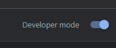

# Final Project -- Hydro Homie Chrome Extension

## About

Hydro Homie is a chrome extension that allows you to set a goal amount (in fl oz.), as well as the size of your waterbottle, to help hold you accountable for staying hydrated when online.

I often find myself struggling to stay hydrated when working on my computer, as I'm focused on my screen. I created this in hope of having an easier time and way to track how much I drink, to hold myself accountable.

This project is built with HTML, CSS, and vanilla Javascript.

## How to Install / Run

1. Download the project files from the link below

   a. <a href="https://download-directory.github.io/?url=https%3A%2F%2Fgithub.com%2Fdylanmullarkey%2Fit3038c-scripts%2Ftree%2Fmain%2Fproject3%2Ffiles">File ZIP download</a>

2. Unzip the files, but keep it in a folder
3. On your Google Chrome browser, navigate to the extensions icon in the top right toolbar. Click the puzzle icon.

   

4. At the bottom of the popup, select Manage Extensions

   

5. In this new tab, turn on Developer mode in the top right.

   Before: 

   

   After: 

   

6. This should provide three new options on the top left. Select "Load unpacked"

   

7. Select the unzipped folder from step 2

8. The extension should be loaded. Return to a new Chrome tab and click the extensions icon. Find Hydro Homie and click it. Selecting the pin icon will bookmark it on your tab toolbar

   

   Bookmarked:
   

## How to Use
The application is fairly simple! Open up the extension, enter a goal amount of fl. oz, and hit the start button! Before starting, make sure to choose the bottle size you have.

Once you've started, use the + and - buttons on the right to add bottles you've drank. Do so until you hit your goal!

You can reset anytime after you start.